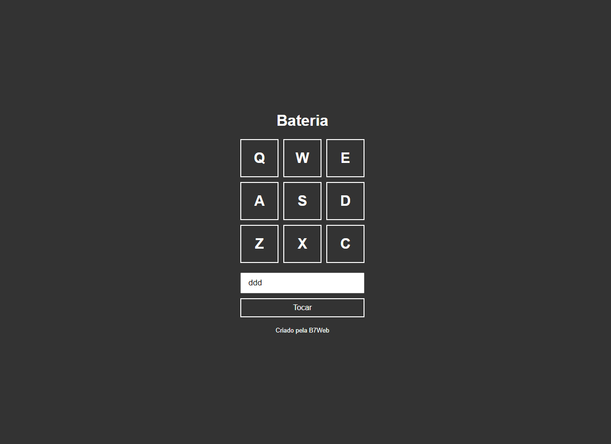
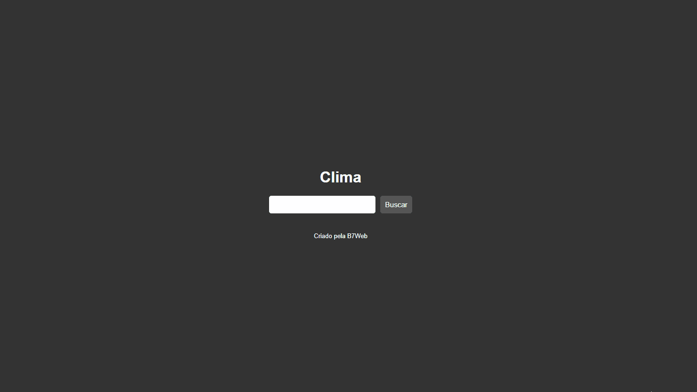
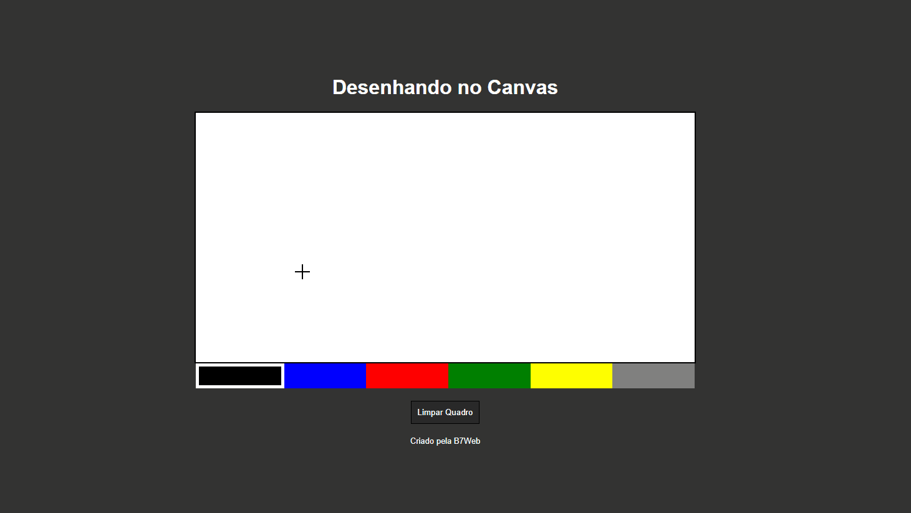
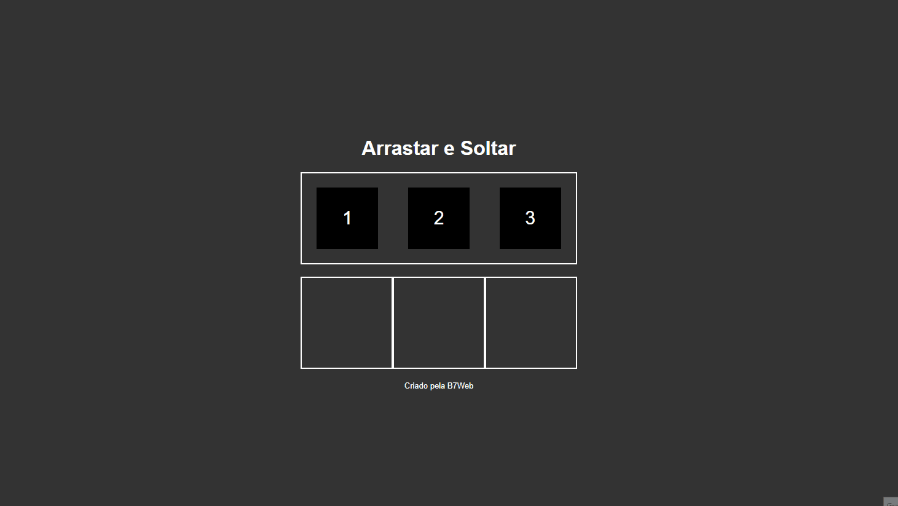
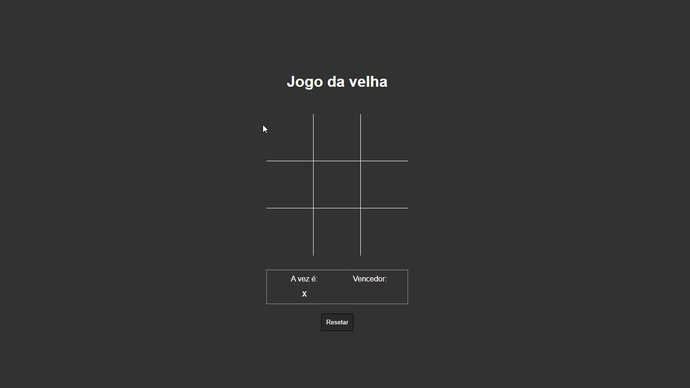
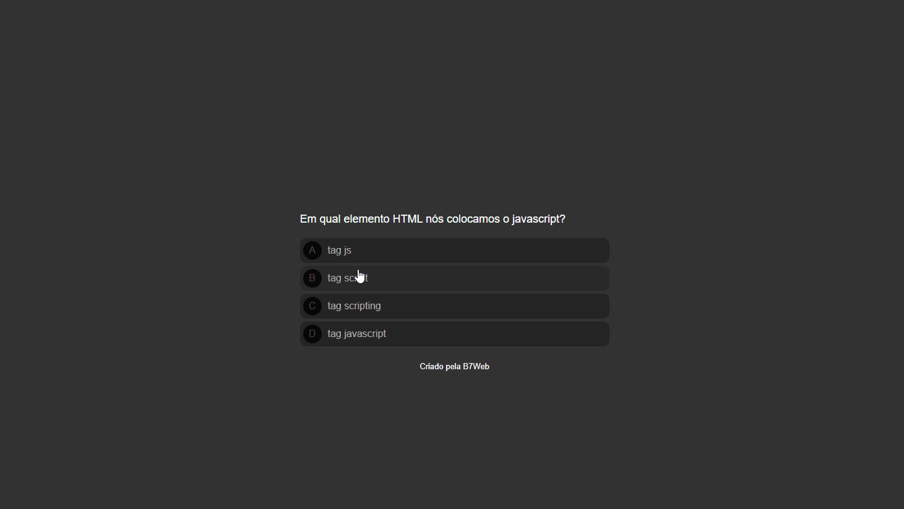
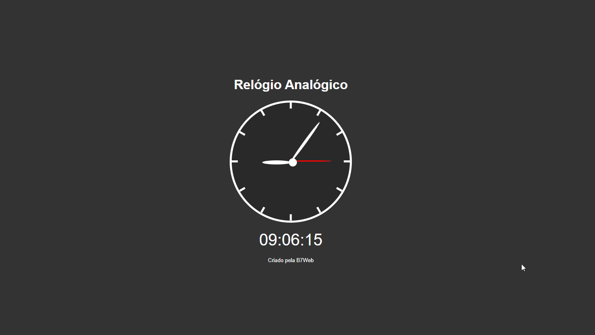

<h1>Projetos com Javascript</h1>

Projetos simples com Javascript para prática de estudos, feitos no ano de 2021.

<h2>Resultados</h2>

Para testar os projetos basta abrir o arquivo index.html de cada projeto na sua máquina

<ul>

<li>
<h3>Bateria Virtual</h3>

</li> 

<li>
<h3>Clima</h3>

</li> 

<li>
<h3>Canvas</h3>

</li> 

<li>
<h3>Arrastar e Soltar</h3>

</li> 

<li>
<h3>Jogo da velha</h3>

</li> 

<li>
<h3>Quiz</h3>

</li> 

<li>
<h3>Relógio</h3>

</li> 

</ul>